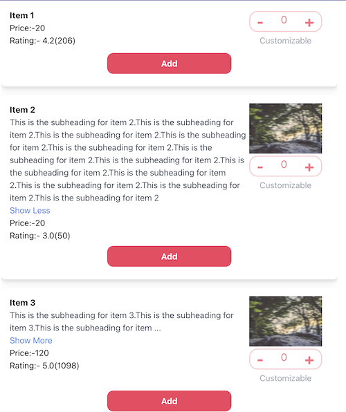

## Introduction
Here is an image showcasing the feature:

      

List View Details

A highly customizable List View Details component for React applications. This package provides an efficient and flexible way to display data in a detailed, organized, and user-friendly list view.

Features

Customizable Layouts: Easily adjust the layout to fit your needs, including customizable list items.

Responsive Design: Fully responsive design ensures a seamless experience on both desktop and mobile devices.

Selection and Actions: Enable item selection and custom actions such as Increment, decrement data.

Theming Support: Easily integrate with your application's theme for a consistent look and feel.
Accessibility: Built with accessibility in mind, ensuring that all users can interact with the component effectively.
Installation

To install the package, use npm or yarn:
 import { Item } from 'list-view-details'
 
Below is example to pass data to plugin.

 const data = [

  {
    id:2,
    imageUrl: 'https://picsum.photos/200/300/?blur=2',
    name: 'Item 2',
    price: '20',
    }, {
    id:3,
    name: 'Item 3',
    description: 'This is the subheading for item 3.This is the subheading for item 3.This is the subheading for item 3.This is the subheading for item 3.This is the subheading for item 3.This is the subheading for item 3.This is the subheading for item 3.This is the subheading for item 3.This is the subheading for item 3.',
    price: '120',
    quantity:0
    }
];

{data.map((item, index) => {
          return <Item imageUrl={item?.imageUrl} name={item?.name} description={item?.description} price={item?.price} quantity={quantities[index]}
            onIncrement={() => handleIncrement(index)}
            onDecrement={() => handleDecrement(index)}
            addCart={() => handleAddCart(index)} />
         }
